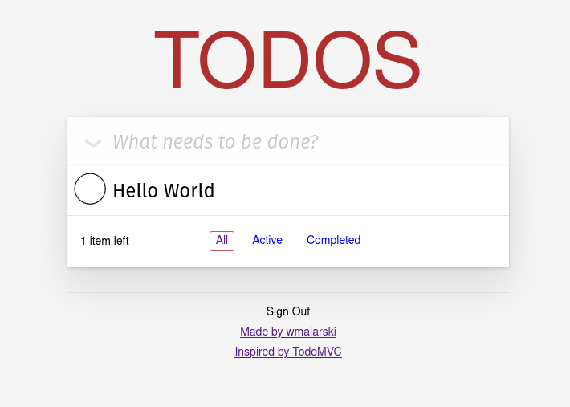

# Qwik City - TODO MVC ⚡️



## TODO List

- [x] Simple email+password authorization
- [x] Cookie session management
- [x] Prisma+Postgresql integration
- [x] Using `loader$` and `action$`(with `zod$` validation)
- [x] Filtering todo list
- [x] Listing and updating todos
- [ ] Optimistic updates
- [ ] Check no JS
- [ ] Docker Deployment

## Project Structure

This project is using Qwik with [QwikCity](https://qwik.builder.io/qwikcity/overview/). QwikCity is just a extra set of tools on top of Qwik to make it easier to build a full site, including directory-based routing, layouts, and more.

Inside your project, you'll see the following directory structure:

```
├── public/
│   └── ...
└── src/
    ├── components/
    │   └── ...
    └── routes/
        └── ...
```

- `src/routes`: Provides the directory based routing, which can include a hierarchy of `layout.tsx` layout files, and an `index.tsx` file as the page. Additionally, `index.ts` files are endpoints. Please see the [routing docs](https://qwik.builder.io/qwikcity/routing/overview/) for more info.

- `src/components`: Recommended directory for components.

- `public`: Any static assets, like images, can be placed in the public directory. Please see the [Vite public directory](https://vitejs.dev/guide/assets.html#the-public-directory) for more info.

## Add Integrations and deployment

Use the `pnpm qwik add` command to add additional integrations. Some examples of integrations include: Cloudflare, Netlify or Express server, and the [Static Site Generator (SSG)](https://qwik.builder.io/qwikcity/static-site-generation/static-site-config/).

```shell
pnpm qwik add # or `yarn qwik add`
```

## Development

Development mode uses [Vite's development server](https://vitejs.dev/). During development, the `dev` command will server-side render (SSR) the output.

```shell
npm start # or `yarn start`
```

> Note: during dev mode, Vite may request a significant number of `.js` files. This does not represent a Qwik production build.

## Preview

The preview command will create a production build of the client modules, a production build of `src/entry.preview.tsx`, and run a local server. The preview server is only for convenience to locally preview a production build, and it should not be used as a production server.

```shell
pnpm preview # or `yarn preview`
```

## Production

The production build will generate client and server modules by running both client and server build commands. Additionally, the build command will use Typescript to run a type check on the source code.

```shell
pnpm build # or `yarn build`
```
